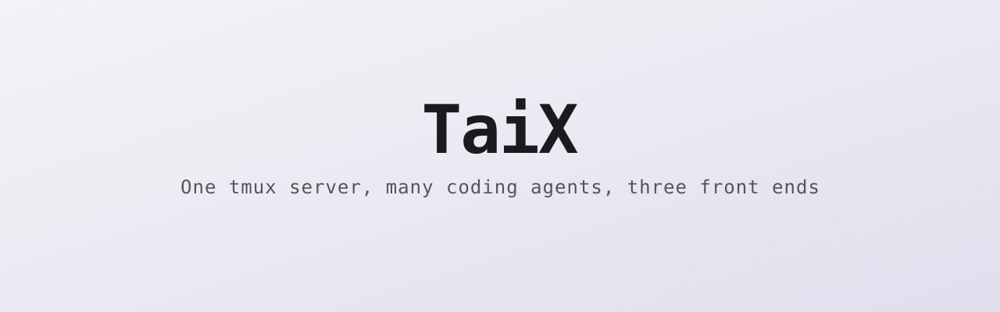
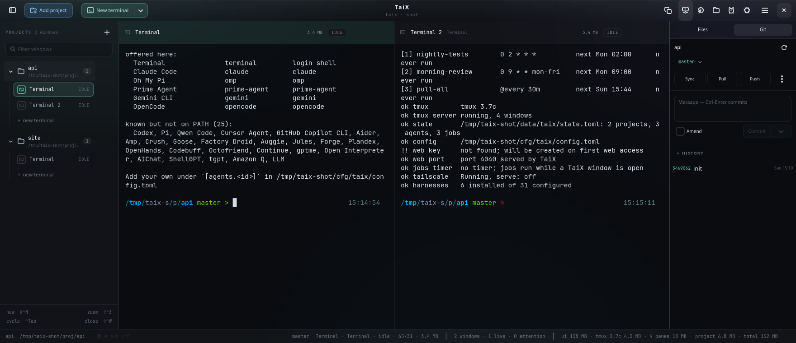

<p align="center">
  <picture>
    <source media="(prefers-color-scheme: dark)" srcset="assets/banner-dark.svg">
    <source media="(prefers-color-scheme: light)" srcset="assets/banner-light.svg">
    
  </picture>
</p>

<p align="center">
  <a href="https://github.com/Osyna/Taix/actions"></a>
  <a href="LICENSE"></a>
  
</p>

TaiX runs your AI coding agents as tmux windows and gives you three ways to
watch them: a GTK desktop window, a terminal UI, and a web page you open on
your phone. All three drive the same tmux server, so a pane you start on the
desktop is the pane you scroll on the sofa.



<sub>`demo.tape` in the repo root records the terminal UI as a GIF: `cargo build --release && vhs demo.tape`.</sub>

## Quick start

Download the static build — one file, no dependencies beyond `tmux`, runs on
any glibc or musl distribution:

```bash
curl -fsSL https://github.com/Osyna/Taix/releases/latest/download/taix-x86_64-linux-musl.tar.gz | tar xz
install -Dm755 taix ~/.local/bin/taix
```

Or build it:

```bash
git clone https://github.com/Osyna/Taix.git
cd Taix
cargo build --release          # target/release/taix - the CLI and the TUI
```

You need `tmux` on `PATH`. Then:

```bash
taix add ~/code/my-project
taix
```

You get the terminal UI with your project in the sidebar. Press `n` to open an
agent window, `t` for a plain shell, `Enter` to type into the focused pane and
`Ctrl-]` to stop typing. `?` lists the keys, `q` quits.

`taix harnesses` shows which agent CLIs it found. TaiX knows 30 of them
(Claude Code, Codex, Gemini CLI, Aider, Goose, Crush, OpenCode and so on) and
offers the ones that are actually on your `PATH`. Anything it does not know
you add yourself in the config.

<details>
<summary>The desktop window, and what each distribution needs</summary>

The GTK front end is a separate binary needing GTK 4.12, libadwaita 1.5 and
WebKitGTK 6. A plain `cargo build` skips it, so the rest of the workspace
compiles on a machine with no GTK at all.

| | CLI + TUI | Desktop |
|---|---|---|
| Debian 13, Fedora 40+, Arch, openSUSE Tumbleweed | yes | yes |
| Ubuntu 24.04 | yes | yes |
| Debian 12, Ubuntu 22.04 | yes | no: GTK 4.8 / 4.6, libadwaita 1.2 / 1.1 |
| Alpine, anything musl | yes (static build) | build it yourself |

Verified by building and running on each: Debian 12 and 13, Ubuntu 22.04 and
24.04, Fedora 42, Arch, Alpine 3.22.

```bash
# Debian 13 / Ubuntu 24.04
sudo apt install libgtk-4-dev libadwaita-1-dev libwebkitgtk-6.0-dev tmux
# Fedora
sudo dnf install gtk4-devel libadwaita-devel webkitgtk6.0-devel tmux
# Arch
sudo pacman -S gtk4 libadwaita webkitgtk-6.0 tmux

cargo build --release -p taix --features gui   # target/release/taix-gui
taix --gui
```

The release also carries a prebuilt `taix-gui` for glibc 2.39 and newer.
Building from source needs Rust 1.85 or newer (edition 2024): Debian 13,
Fedora and Arch ship that, Ubuntu 24.04 and Debian 12 do not — use
[rustup](https://rustup.rs) there.

</details>

Config lives at `$XDG_CONFIG_HOME/taix/config.toml` (or
`~/.config/taix/config.toml`). State lives at `$XDG_DATA_HOME/taix/` (or
`~/.local/share/taix/`).

## How it works

One tmux server holds every project's windows. A single `tmux -CC` control
connection carries all of it: command replies and every pane's output arrive
demultiplexed down one pty, so ten panes cost one connection rather than ten
emulators. The pane you are looking at is a live terminal emulator; the rest
are refreshed from batched `capture-pane` reads.

That is also why the front ends can disagree about what they are showing
without disagreeing about state: the desktop, the TUI and a phone can each
look at a different project, and closing all of them leaves the agents running
in tmux.

## The desktop

Projects sit in a sidebar, their agent windows tile as panes. The focused pane
takes the whole keyboard; TaiX keeps only `Ctrl+Shift`.

| Key | Action |
|-----|--------|
| `Ctrl+Shift+N` | New window |
| `Ctrl+Shift+T` | Toggle files panel |
| `Ctrl+Shift+G` | Toggle git panel |
| `Ctrl+Shift+B` | Toggle browser panel (with `--features browser`) |
| `Ctrl+Shift+P` | Command palette |
| `Ctrl+Shift+F` | Find in pane |
| `Ctrl+Shift+R` | Rename focused window |
| `Ctrl+Shift+W` | Close focused window |
| `Ctrl+Shift+K` | Stop focused window (offers to discard worktree) |
| `Ctrl+Shift+E` | Fold/unfold selected project |
| `Ctrl+Shift+Z` | Zoom focused pane |
| `Ctrl+Shift+M` | Mute/unmute selected project |
| `Ctrl+Shift+S` / `O` | Save / open a session |
| `Ctrl+Shift+J` | Automation (scheduled jobs) |
| `Ctrl+Shift+V` / `C` | Paste (images become file paths) / copy |
| `Ctrl+Shift++` / `-` / `0` | Pane font size |
| `Ctrl+Shift+1`…`9` | Focus the nth window of this project |
| `Ctrl+Shift+←` / `→` | Previous / next project |
| `Ctrl+Shift+↑` / `↓` | Scroll pane history one line |
| `Ctrl+Tab` | Cycle focus |
| `Shift+PgUp` / `PgDn` | Scroll pane history one page |

## The phone

Turn the web server on in Settings or set `web.enabled = true`. It listens on
port 4040 and the status bar shows the LAN address to type.

The page is not open to the network. A device with no pairing cookie gets a
pairing page and nothing else; the desktop raises an amber chip, you tap Pair
or Deny, and the approved device gets a cookie bound to its IP. The key lives
at `$XDG_DATA_HOME/taix/web.key` (mode 0600) and survives restarts — rotate it
from the pairing popover to drop every paired device at once.

Set `web.tailscale = true` to bind the tailnet address instead of every
interface. To put HTTPS in front of it, start TaiX first and then
`tailscale serve` the local port.

The phone page is a real terminal, not a log viewer: the browser picks a
legible font size, derives the grid from its own screen and tells the desktop
to resize the tmux window to match, so you are never reading a 137-column pane
through a keyhole.

## Scheduled jobs

Jobs run a shell command, open a harness with a prompt, restore a session, or
run a git operation. They fire while any TaiX window is open; install the
systemd user timer to keep them firing when everything is closed.

```bash
taix jobs                                  # list all jobs
taix jobs add <name> --at <when> ...       # create a job
taix jobs rm|on|off|run <id|name>          # delete, enable, disable, run now
taix jobs log <id|name> [-n <lines>]       # output of past runs (default 200)
taix jobs history [<id|name>] [-n <runs>]  # exit codes and durations
taix jobs install                          # systemd user timer, wakes each minute
taix jobs uninstall
```

`--at` takes `@hourly` / `@daily` / `@weekly` / `@monthly` / `@yearly`,
`@every 90m`, five cron fields, or a one-shot `YYYY-MM-DD HH:MM` that disables
the job after it fires. Cron fields take `*`, `*/n`, `a-b`, `a,b` and `n`, and
month and weekday names in either form:

```bash
--at "@every 30m"
--at "0 9 * * mon-fri"     # 09:00 on weekdays
--at "0 0 1 jan,jul *"     # midnight on 1 January and 1 July
--at "2026-12-25 09:00"    # once
```

Cron arithmetic is done in local civil time, so a job at 09:00 stays at 09:00
across a DST change rather than drifting an hour.

Pick exactly one action:

- `--run <command>` — a shell command
- `--agent <harness> --ask <prompt>` — open an agent and type a prompt
- `--session <name>` — restore a saved session
- `--git <op>` — `fetch`, `pull`, or `push`

And optionally: `--project <p>` (id, name or path; required for `--agent`),
`--cwd <dir>`, `--timeout <secs>` (default 900), `--notify never|failure|always`,
`--reuse` to take over an existing window, `--no-catch-up` to skip a job that
was already overdue when TaiX started. `{project}`, `{root}`, `{date}` and
`{time}` expand inside `--run` and `--ask`.

## Other ways in

```bash
taix -t                 # list projects with their ids
taix -t -s <id>         # open one as a plain tmux session, laid out like the GUI
taix mcp                # MCP stdio server, so an agent can drive TaiX
taix save|sessions|restore <name>
taix doctor             # config, tmux server and harness health
```

`isolate = true` gives every new window its own git worktree on its own
branch, and closing the window offers to merge it back or throw it away.

## Config reference

All keys go in `$XDG_CONFIG_HOME/taix/config.toml`.

| Key | Default | Description |
|-----|---------|-------------|
| `tmux_socket` | `"taix"` | tmux socket name (the `-L` argument) |
| `tmux_session` | `"taix"` | tmux session name |
| `idle_after_ms` | `2000` | milliseconds of quiet before an agent counts as idle |
| `theme` | none | theme name (omit for the system default) |
| `font_size` | `10.0` | pane font size in points |
| `browser_home` | `"about:blank"` | browser panel landing page |
| `editor` | none | editor command or catalogue id (`code`, `nvim`, …); falls back to `$VISUAL`, `$EDITOR` |
| `isolate` | `false` | give every new window its own git worktree on a branch |
| `bar` | `["where", "branch", "window", "windows", "memory"]` | bottom bar segments (`where`, `branch`, `window`, `windows`, `memory`, `uptime`, `empty`) |
| `reap_idle_after_ms` | none | stop an agent after this long idle (omit to never reap) |
| `harness_order` | `[]` | harness ids in menu order; the rest follow in catalogue order |
| `web.enabled` | `true` | start the web server |
| `web.port` | `4040` | web server port |
| `web.tailscale` | `false` | bind the tailnet address only |

Add or override a harness in `[agents.<id>]`:

```toml
[agents.claude]
label = "Claude"
command = "claude --api-key ..."
icon = "claude"
color = "blue"
hidden = false
```

Every field is optional; omitted ones keep the catalogue default.

## What it does not do

- **Linux only.** It reads `/proc` and installs systemd user units; building it
  anywhere else fails at compile time rather than misbehaving at runtime.
- **No packages.** No AUR, no crates.io, no release binaries. Build from source.
- **No agent API of its own.** TaiX runs whatever CLI you already have and reads
  its terminal. It does not talk to model providers, and it holds no API keys.
- **One tmux server.** Everything shares the socket named in `tmux_socket`; kill
  that server from outside and the windows go with it (the layout is restored
  from the store on the next start).

## Troubleshooting

```bash
taix doctor
```

TaiX keeps going when something it can live without fails: a capture that did
not answer, a `git` invocation that errored, a request it refused. Those are
silent by design. `TAIX_LOG=1` prints them to stderr instead:

```bash
TAIX_LOG=1 taix --gui
```

**Port already in use:** something else holds the web port. Change `web.port`
or stop it.

**tmux server gone:** the session was killed from outside. Close the window and
reopen; the layout comes back from the store.

**Agent not found:** the harness command is not on the `PATH` TaiX sees. Check
`taix harnesses`. A desktop launcher inherits the session `PATH`, not your
shell's — start `taix --gui` from a terminal to compare.

## Desktop entry

```bash
install -Dm644 packaging/dev.taix.TaiX.desktop \
  ~/.local/share/applications/dev.taix.TaiX.desktop
```

## Contributing

Issues and pull requests are welcome — see [CONTRIBUTING.md](CONTRIBUTING.md)
for the build, the test commands and what CI will run against your branch.
Security reports go through [SECURITY.md](SECURITY.md), not the issue tracker.

## License

[Apache-2.0](LICENSE).
